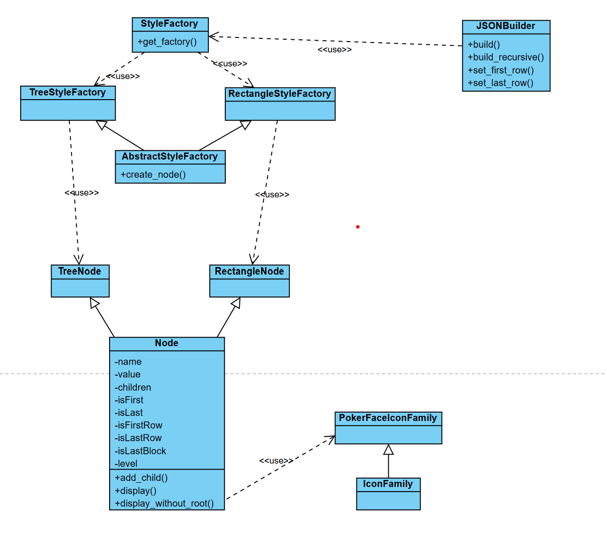
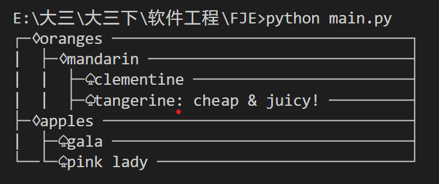
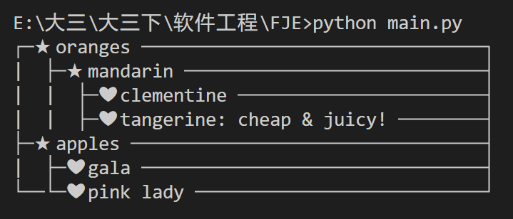

# Funny-Json-Explorer (FJE)
软件工程作业

## 使用
直接 `python main.py` 即可运行
图标的设置在 `iconFamily.py` 中设置

## 文件介绍

* `styleFactory.py`：主要包含了工厂类，根据输入的类型返回对应的工厂类
* `node.py`：包含了树形、矩形节点
* `iconFamily.py`：图标族，可以自定义图标
* `builder.py`：构建节点
* `main.py`：主函数执行
* `results/`：四种结果保存的图片

