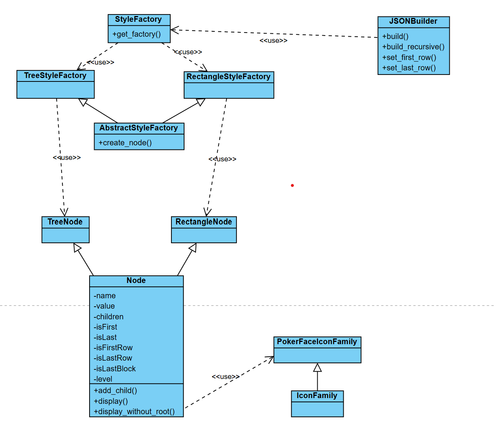
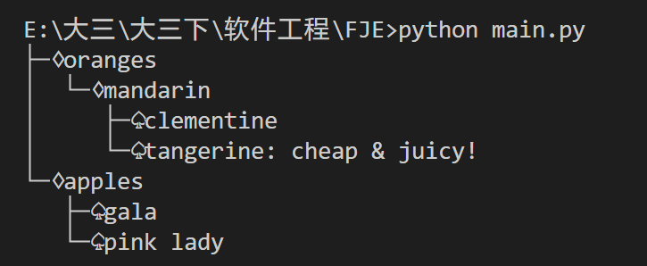
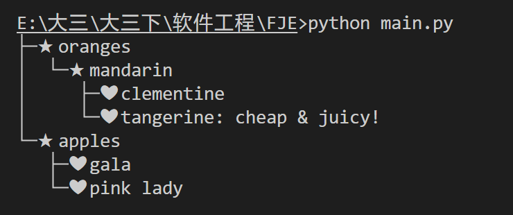
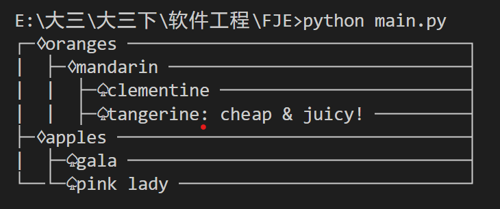
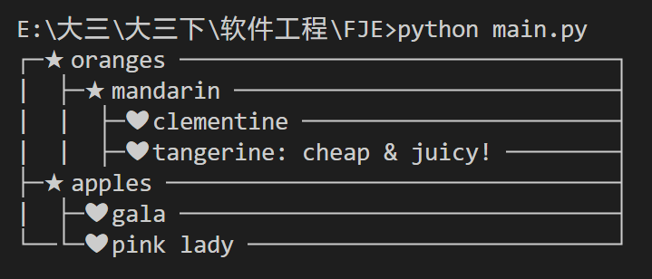

|姓名|学号|专业|
|-|-|-|
|黄世杰|21307038|计算机科学与技术|

## 文件与说明

* `styleFactory.py`：主要包含了工厂类，根据输入的类型返回对应的工厂类
* `node.py`：包含了树形、矩形节点
* `iconFamily.py`：图标族，可以自定义图标
* `builder.py`：构建节点
* `main.py`：主函数执行

## 类 与 设计模式

类图：

* `styleFactory.py` 中的 `StyleFactory` 类，用于创建对应类型的工厂类，可以根据对应的工厂类通过builder创建节点，使用了**工厂设计模式**
    * 作用：更方便创建需要使用的类，良好的封装和扩展
* `builder.py` 中的 `JSONBuilder` 类，用于构建节点，使用了**建造者设计模式**
    * 作用：用于构建所需要的内容，封装性好，易于扩展
* `node.py` 中的 `Node` 类中集成了节点的level等内容，使用了**组合设计模式**
    * 作用：层次分明，设计更加抽象

## 执行结果

